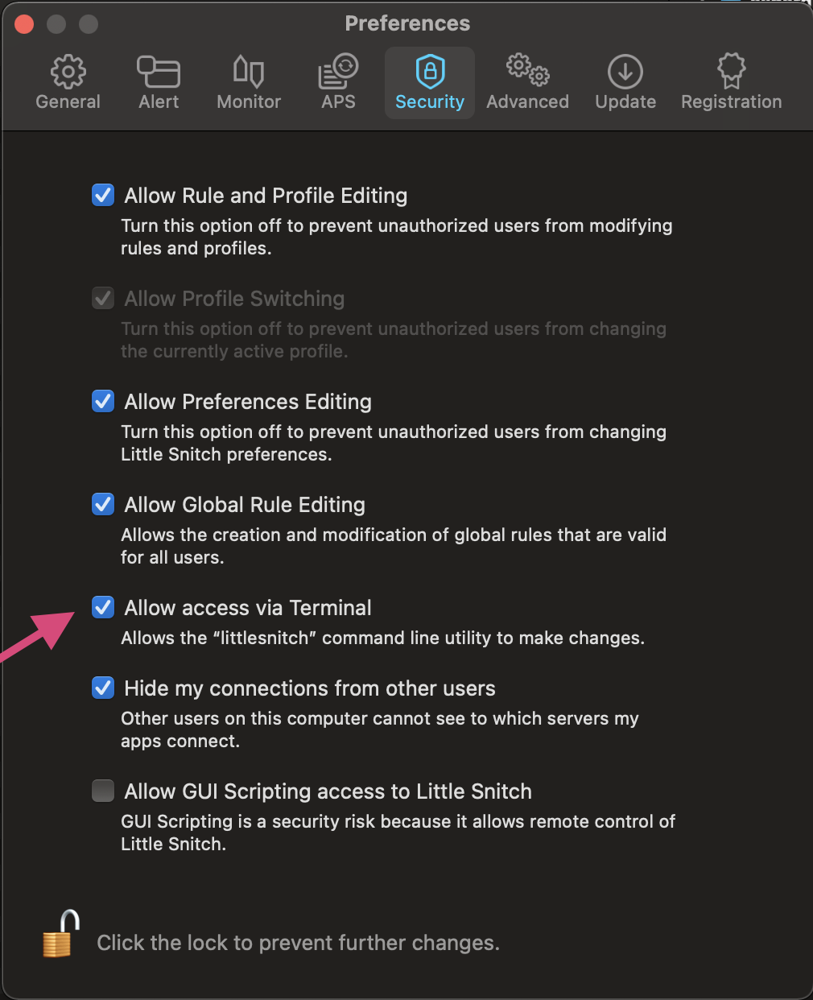

# littlesnitch-log-exporter

A log statistics exporter for [LittleSnitch](https://www.obdev.at/products/littlesnitch/index.html) macOS personal packet filter by Objective Development.

## Use Case

The idea is to create a frequent export of all connections made from or to a macOS system in order to identify suspicious or malicious behaviour. 

Since LittleSnitch 5, Objective Development offers a command line interface to query the internal database for all connections made by an application (`sudo littlesnitch log-traffic`). As this output lists every connection made by every application on you macOS, is very noisy and fills up a SIEM with lot of unnecessary data.

LittleSnitch log exporter condenses these lines to statistics for each application/remote host/remote port combination and thus reduces the log volume significantly. 

Log data of one hour standard macOS workstation traffic: 

```bash
sudo littlesnitch  log-traffic -b '2021-01-02 11:00:00' | wc -l
   15709
sudo python3 ./littlesnitch-log-exporter.py -m 60 | wc -l
     370
```

The standard log export looks like this (CSV):

```csv
date,direction,uid,ipAddress,remoteHostname,protocol,port,connectCount,denyCount,byteCountIn,byteCountOut,connectingExecutable,parentAppExecutable
2021-01-02T10:02:00Z,out,501,8.8.8.8,dns.google,17,443,0,0,1284,199,"/Applications/Google Chrome.app/Contents/Frameworks/Google Chrome Framework.framework/Versions/87.0.4280.88/Helpers/Google Chrome Helper.app/Contents/MacOS/Google Chrome Helper","/Applications/Google Chrome.app/Contents/MacOS/Google Chrome"
```

It's a CSV file with every single connection made by every app. 

The export generated by LittleSnitch log exporter looks like this:

```bash
2021-01-02 12:10:35,634 prometheus.local: APP: '/Applications/Google Chrome.app/Contents/Frameworks/Google Chrome Framework.framework/Versions/87.0.4280.88/Helpers/Google Chrome Helper.app/Contents/MacOS/Google Chrome Helper' DIRECTION: OUT IP: 8.8.8.8 HOST: 'dns.google' PORT: 53 ACTION: ALLOWED COUNT: 255
```

It's a summary of each app's connections (see COUNT), contains a timestamp (time of statistics generation) and a hostname for easier processing in your log management solution (SIEM).

The idea is to schedule a log export, e.g. with a local cron job and syslog forwarding or using the script input of commercial agents like [splunk's forwarder](https://docs.splunk.com/Documentation/Splunk/latest/Admin/inputsconf#Scripted_Input:). 

## Requirements

- LittleSnitch 5
- Python 3
- Root access

## Get Started

1. Download Python script
2. Check "Allow access from terminal" in LittleSnitch Preferences > Security (see image below)
3. Run the script `sudo python3 littlesnitch-log-exporter.py`

By default, it will return statistics over the last 60 minutes. 

## Show Only Noteworthy Connections

I've implemented a feature that allows you to filter all expected traffic and show only connections considered 'noteworthy'. With the use of the predefined filters you can filter down the connections made by your system in 24h to handful that can be reviewed manually.

Show only noteworthy connections of the last 24 hours. 

```
sudo python3 littlesnitch-log-exporter.py -m 3600 --noteworthy
```


### Allow Terminal CLI Access

In order to access the log data, you have to grant access to the command line interface tool. 



## Frequent Log Statistics Export

TBD